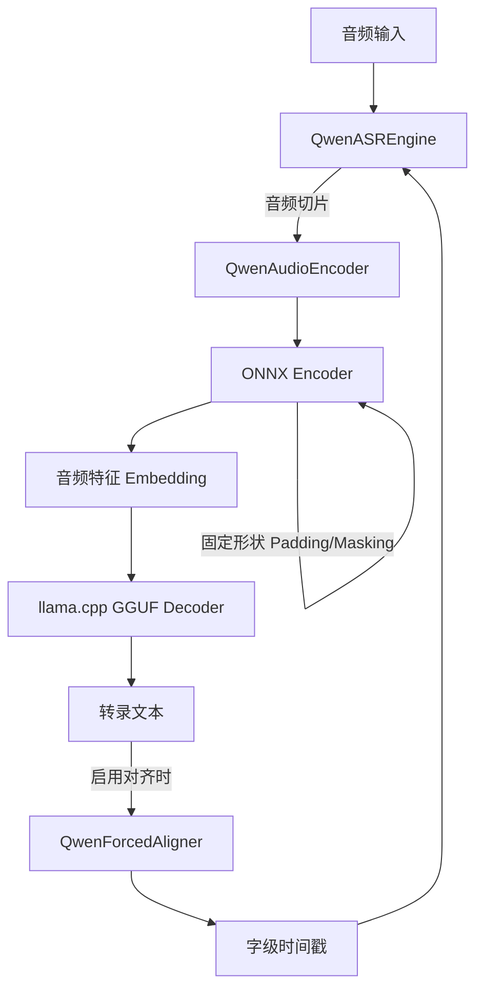
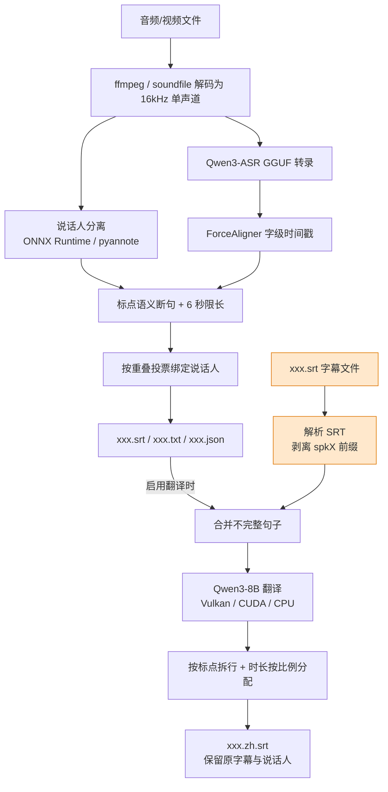

# Qwen3-ASR GGUF

将 [Qwen3-ASR](https://www.modelscope.cn/collections/Qwen/Qwen3-ASR) 模型转换为可本地高效运行的混合格式，实现**快速、准确的离线语音识别**。

主要依赖 [llama.cpp](https://github.com/ggml-org/llama.cpp) 加速 LLM Decoder。

Qwen3-ASR 0.6B 与 Qwen3-ASR 1.7B 以及 Qwen3-ForceAligner 0.6B 均可用，


### 核心特性

- ✅ **纯本地运行** - 无需网络，数据不外传
- ✅ **速度快** - 混合推理架构 (ONNX Encoder + GGUF Decoder)
- ✅ **GPU 加速** - 支持 Vulkan / DirectML 
- ✅ **流式输出** - 无限时长的音频文件，流式转录
- ✅ **字幕输出** - ForceAligner 对齐字级时间戳，输出 SRT/JSON 格式
- ✅ **上下文增强** - 可提供上下文信息，提升准确率
- ✅ **说话人识别** - 分离说话人，字幕自动打上 `[spk0]` 标记
- ✅ **说话人识别双后端** - ONNX Runtime（DirectML / CUDA / CPU，无需 HF Token）或 pyannote 原生 PyTorch
- ✅ **智能断句** - 按标点做语义断句，每行字幕控制在 6 秒内
- ✅ **字幕翻译** - Qwen3-8B GGUF 在识别结果上再译一份，保留说话人与时间轴，原字幕文件不动
- ✅ **只翻译字幕** - 可直接把 `.srt` 丢进来，跳过解码 / 说话人识别 / 语音识别，省掉整条识别链路
- ✅ **翻译加速** - Vulkan / CUDA / CPU 可选（复用 llama.cpp 二进制，无需额外 Python 依赖）
- ✅ **图形界面** - ttkbootstrap 桌面端，批量处理 + 实时预览

## 性能表现

1.7B 在 RTX 5050 笔记本上的实测数据（50秒中文音频）：

```
(fun) PS D:\qwen3-asr> python .\transcribe.py .\test.mp3 -y
╭─────── Qwen3-ASR 配置选项 ───────╮
│  模型目录    D:\qwen3-asr\model  │
│  编码精度    int4                │
│  加速设备    DML:ON | Vulkan:ON  │
│  时间戳对齐  启用                │
│  语言设定    自动识别            │
╰──────────────────────────────────╯
--- [QwenASR] 初始化引擎 (DML: True) ---
--- [QwenASR] 辅助进程已就绪 ---
--- [QwenASR] 引擎初始化耗时: 3.61 秒 ---

开始处理: test.mp3

...
你怎么看待两个月之前的判断？
当初的判断不变，
美国对于委内瑞拉的突袭性质依然是政治投机，
不能算是地面战争。
入侵的美国军队总数是一两百，
站在委内瑞拉领土上的时间不超过一个小时，
算是。


📊 性能统计:
  🔹 RTF (实时率) : 0.052 (越小越快)
  🔹 音频时长    : 50.20 秒
  🔹 总处理耗时  : 2.59 秒
  🔹 编码等待    : 0.21 秒
  🔹 对齐总时    : 0.83 秒 (分段异步对齐)
  🔹 LLM 预填充  : 0.420 秒 (1742 tokens, 4149.1 tokens/s)
  🔹 LLM 生成    : 1.670 秒 (191 tokens, 114.4 tokens/s)
✅ 已保存文本文件: test.txt
✅ 已生成字幕文件: test.srt
✅ 已导出时间戳: test.json
```

CPU 的速度：

```
> python .\transcribe.py --no-dml --no-vulkan .\test.mp3 -y
╭──────── Qwen3-ASR 配置选项 ────────╮
│  模型目录    D:\qwen3-asr\model    │
│  编码精度    int4                  │
│  加速设备    DML:OFF | Vulkan:OFF  │
│  时间戳对齐  启用                  │
│  语言设定    自动识别              │
╰────────────────────────────────────╯
--- [QwenASR] 初始化引擎 (DML: False) ---
--- [QwenASR] 辅助进程已就绪 ---
--- [QwenASR] 引擎初始化耗时: 2.75 秒 ---

开始处理: test.mp3

...
你怎么看待两个月之前的判断？
当初的判断不变，
美国对于委内瑞拉的突袭性质依然是政治投机，
不能算是地面战争。
入侵的美国军队总数是一两百，
站在委内瑞拉领土上的时间不超过一个小时，
算是。


📊 性能统计:
  🔹 RTF (实时率) : 0.390 (越小越快)
  🔹 音频时长    : 50.20 秒
  🔹 总处理耗时  : 19.60 秒
  🔹 编码等待    : 0.80 秒
  🔹 对齐总时    : 7.90 秒 (分段异步对齐)
  🔹 LLM 预填充  : 10.742 秒 (1741 tokens, 162.1 tokens/s)
  🔹 LLM 生成    : 7.009 秒 (190 tokens, 27.1 tokens/s)   
✅ 已保存文本文件: test.txt
✅ 已生成字幕文件: test.srt
✅ 已导出时间戳: test.json
```

## 显存占用

以 1.7B ASR 和 0.6B Aligner 载入为例，Encoder int4 量化，Decoder q4_k 量化。

开启 DML 时：

- ASR Encoder     占用显存 473MB
- Aligner Encoder 占用显存 420MB

开启 Vulkan 时：

- ASR Decoder     模型占用显存 1064MB，上下文占用显存 228 MB，推理占用 304MB，总共 1.6GB
- Aligner Decoder 模型占用显存  372MB，上下文占用显存 228 MB，推理占用 299MB，总共 0.9GB

所以开启 DML 需备足 900M 显存，开启 Vulkan 需备足 2.5G 显存。


## 快速开始

### 1. 安装依赖

使用UV
```bash
uv sync
```

```bash
pip install onnxruntime-directml numpy scipy gguf srt ttkbootstrap
```

> 说话人识别默认走 **ONNX Runtime**，只需 `onnxruntime-directml`（AMD / Intel / NVIDIA 通用）。
> 如需 CUDA 加速改用 `onnxruntime-gpu`，纯 CPU 用 `onnxruntime`。
> 想用 pyannote 原生实现再额外装 `pip install pyannote.audio`。

转换格式还需要：

```bash
pip install torch transformers==4.57.6
```

> **导出 ONNX 说话人模型**需要 `torch` + `pyannote.audio`（只需执行一次）；
> 导出完成后的**日常推理不再依赖 torch 与 HF Token**。

> `pydub` 需要系统安装 [ffmpeg](https://ffmpeg.org/download.html)
> 
> 依赖可能写得不是那么全，缺啥就装啥呗，没有需要自己编译的

从 [llama.cpp Releases](https://github.com/ggml-org/llama.cpp/releases) 下载预编译二进制，将 DLL 放入 `qwen_asr_gguf/bin/`：

| 平台 | 下载文件 |
|------|----------|
| **Windows** | `llama-bXXXX-bin-win-vulkan-x64.zip` |

### 2. 下载模型


#### 2.1 下载模型

到 [Models Release](https://github.com/HaujetZhao/Qwen3-ASR-GGUF/releases/tag/models) 下载已经转换好的模型打包文件，下载后解压到 `model` 文件夹。

ASR 模型有 0.6B 和 1.7B 的，后者精度更高，但慢些。

Aligner 模型是 0.6B 的。

为节约显存，打包的模型：

- Encoder 全部 int4 量化，与 fp16 输出的数值余弦相似度 96%
- Decoder 全部 q4_k 量化，比 fp16 输出的困惑度仅增加 8.7%

对于语音识别，量化带来的精度差异小到可以忽略。

如果执意要用其它精度（fp32、fp16、int8）可以自行手动导出。


#### 2.3 字幕翻译模型（可选）

启用 `--translate` 时还需要一个翻译用的 LLM：

| 文件 | 大小 | 说明 |
|------|------|------|
| `Qwen3-8B-Q4_K_M.gguf` | 约 4.7 GB | 通用多语翻译，Q4_K_M 量化 |

直接放到 `model/` 目录即可，程序按文件名查找（可用 `--translate-model` 改成别的名字）：

```bash
# ModelScope
modelscope download --model Qwen/Qwen3-8B-GGUF Qwen3-8B-Q4_K_M.gguf --local_dir ./model

# HuggingFace
huggingface-cli download Qwen/Qwen3-8B-GGUF Qwen3-8B-Q4_K_M.gguf --local-dir ./model
```

> 💡 其它 Qwen3 系列 GGUF（4B / 14B / 32B）也能直接用，只要满足：
> ① 使用 ChatML 模板（词表里有 `<|im_start|>` / `<|im_end|>`）；
> ② 文件名与 `--translate-model` 一致。
>
> ⚠️ 翻译模型体积较大，不会随 Release 的模型包一起分发，需要单独下载。


#### 2.2 手动导出

下载原始模型：

```bash
pip install modelscope
modelscope download --model Qwen/Qwen3-ASR-0.6B
modelscope download --model Qwen/Qwen3-ForcedAligner-0.6B
```

配置 `export_config.py`，定义官方模型路径、导出路径：

```python
from pathlib import Path
model_home = Path('~/.cache/modelscope/hub/models/Qwen').expanduser()

# [源模型路径] 官方下载好的 SafeTensors 模型文件夹
ASR_MODEL_DIR =  model_home / 'Qwen3-ASR-0.6B'
ALIGNER_MODEL_DIR =  model_home / 'Qwen3-ForcedAligner-0.6B'

# [导出目标路径] 转换后的 ONNX, GGUF 和权重汇总目录
EXPORT_DIR = r'./model'

```

导出模型：

```bash
# === 1. ASR 模型导出流程 ===
python 01-Export-ASR-Encoder-Frontend.py     # 导出 Encoder 前段 (CNN)
python 02-Export_ASR-Encoder-Backend.py      # 导出 Encoder 后段 (Transformer)
python 03-Optimize-ASR-Encoder.py            # 优化 ONNX 模型
python 04-Quantize-ASR-Encoder.py            # 编码器量化 (FP16/INT8/INT4)
python 05-Export-ASR-Decoder-HF.py           # 提取 Decoder 权重
python 06-Convert-ASR-Decoder-GGUF.py        # 转为 GGUF 格式 (FP16)
python 07-Quantize-ASR-Decoder-GGUF.py       # GGUF 二次量化 (Q4_K)

# === 2. Aligner 模型导出流程 ===
python 11-Export-Aligner-Encoder-Frontend.py
python 12-Export-Aligner-Encoder-Backend.py
python 13-Optimize-Aligner-Encoder.py
python 14-Quantize-Aligner-Encoder.py
python 15-Export-Aligner-Decoder-HF.py
python 16-Convert-Aligner-Decoder-GGUF.py
python 17-Quantize-Aligner-Decoder-GGUF.py
```

### 3. 转录测试

推荐使用 `transcribe.py` 命令行工具进行转录，支持丰富的参数配置：

```bash
# 基本用法
python transcribe.py test.mp3

# 添加参数，如禁用 dml
python transcribe.py test.mp3 --prec int4 --no-dml --no-vulkan --n-ctx 4096
```

也可以参考 `21-Run-ASR.py` 在 Python 代码中调用：

```bash
python 21-Run-ASR.py
```

### 4. 说话人识别 + 字幕

在转录的基础上增加说话人分离，输出**带说话人标记、按标点断句、每行 ≤ 6 秒**的 SRT 字幕。

说话人识别有**两种推理后端**，用 `--diar-backend` 切换：

| 后端 | 说明 | 依赖 |
|------|------|------|
| `onnx`（**推荐**） | 纯 onnxruntime 推理，支持 **DirectML** / CUDA / CPU。不需要 torch，**不需要 HF Token** | 需先导出模型（见下） |
| `pyannote` | pyannote.audio 原生 PyTorch 实现，CPU / CUDA | `pyannote.audio` + HF Token |
| `auto`（默认） | 本地有 ONNX 模型就用 `onnx`，否则回退 `pyannote` | — |

两种后端**输出完全一致**（30 秒双人样本实测帧级 IoU = 1.0000、说话人划分一致率 100%），
区别只在速度与硬件适配。AMD 显卡上 `pyannote` 通常只能跑 CPU，而 `onnx` + DirectML 可以走 GPU：

| 输入时长 | ONNX + DirectML | ONNX + CPU | pyannote (CPU) |
|---------|-----------------|------------|----------------|
| 30 s | 7.3 s | 5.0 s | 10.1 s |
| 180 s | **8.2 s (RTF 0.046)** | 47.9 s (RTF 0.266) | — |

> 短音频上 DirectML 因固定开销略慢于 CPU，长音频优势明显（**快 5.8 倍**）。

#### 首次使用：导出 ONNX 模型（一次性）

```bash
uv run python 30-Export-Diarization-ONNX.py
```

脚本会从 HuggingFace 拉取 `pyannote/segmentation-3.0` 与 `pyannote/wespeaker-voxceleb-resnet34-LM`，
导出为 `model/diarization_segmentation.onnx`（约 5.9 MB）与 `model/diarization_embedding.onnx`（约 26.5 MB），
导出后即可**完全脱离 torch 与 HF Token** 运行说话人识别。

```bash
# 默认 auto：有 ONNX 模型自动走 onnx
uv run python transcribe.py ".\会议录音.m4a"

# AMD 显卡走 GPU（DirectML）
uv run python transcribe.py ".\会议录音.m4a" --diar-backend onnx --spk-device dml

# 明确指定 3 位说话人
uv run python transcribe.py ".\三方通话.mp3" --speakers 3

# 回退 pyannote 原生实现
uv run python transcribe.py ".\会议录音.m4a" --diar-backend pyannote --hf-token hf_xxx

# 关闭说话人识别（仅转录）
uv run python transcribe.py ".\video.m4a" --no-diarization
```

参数说明：

| 参数 | 说明 |
|------|------|
| `--speakers/-s` | 说话人数，`0` 表示自动检测（默认） |
| `--max-speakers` | 自动检测时的说话人上限（默认 20） |
| `--no-diarization` | 关闭说话人识别，仅输出纯文本字幕 |
| `--diar-backend` | 说话人推理后端：`auto` / `onnx` / `pyannote` |
| `--spk-device` | 说话人识别设备：`auto` / `cpu` / `cuda` / `dml`（`dml` 仅 `onnx` 后端有效） |
| `--hf-token` | HuggingFace Token（**仅 `pyannote` 后端需要**） |
| `--max-line-duration` | 每行字幕最长时长（秒），默认 `6.0` |
| `--max-line-chars` | 每行字幕最长字数，默认 `48` |

> ⚠️ 只有 `pyannote` 后端需要 Token：`pyannote/speaker-diarization-3.1` 是 HuggingFace 上的 gated 模型，
> 首次使用需到模型主页同意协议并在 [Access Tokens](https://huggingface.co/settings/tokens) 生成 Token，
> 通过 `--hf-token` 传入或设置环境变量 `HF_TOKEN`。
>
> **ONNX 后端不需要 Token**（用本地已导出的模型）。任一后端不可用时，程序会自动降级为**纯文本字幕**，不会中断任务。

生成的 SRT 形如：

```srt
1
00:00:06,720 --> 00:00:08,880
[spk0] Hello. Hello. Oh, hello!

2
00:00:08,880 --> 00:00:11,200
[spk1] I didn't know you were there. Neither did I.
```

### 5. 字幕翻译（可选）

在识别出的字幕基础上再翻译一份，**保留原字幕文件**，译文另存为 `<原名>.zh.srt`。

```bash
# 基础用法：英译中（使用默认提示词）
uv run python transcribe.py ".\会议录音.m4a" --translate

# Vulkan 加速（AMD / Intel / NVIDIA 通用）
uv run python transcribe.py ".\video.m4a" --translate --translate-backend vulkan

# CUDA 加速（需自行把 llama.cpp 二进制换成 CUDA 版）
uv run python transcribe.py ".\video.m4a" --translate --translate-backend cuda

# 自定义提示词
uv run python transcribe.py ".\video.m4a" --translate --translate-prompt-file prompt.txt
```

翻译规则由程序侧保证，不依赖模型自由发挥：

| 规则 | 实现 |
|------|------|
| 只翻完整语义 | 某行结尾没有句末标点（`.?!…`）时，与后续行**合并**后再送翻译，直到遇到句末标点 |
| 时长守恒 | 合并块总时长 = 参与各行的**时长之和**；译文拆回多行后整体时长与合并块一致 |
| 每行 ≤ 6 秒 | 译文优先按标点拆行，拆完仍超长的再按字符硬拆，保证每行 ≤ `--translate-max-line-duration` |
| 保留说话人 | 每行译文仍以 `[spk0]` 开头；**说话人切换处不会合并**，避免标记错位 |
| 原字幕保留 | 只新增 `<原名>.zh.srt`，原先的 `.srt` / `.txt` / `.json` 原封不动 |

参数说明：

| 参数 | 说明 |
|------|------|
| `--translate` | 开启字幕翻译（默认关闭） |
| `--translate-model` | 翻译模型文件名，默认 `Qwen3-8B-Q4_K_M.gguf` |
| `--translate-backend` | 加速后端：`auto` / `vulkan` / `cuda` / `cpu` |
| `--translate-gpu-layers` | 卸载到 GPU 的层数，`-1` 表示全部 |
| `--translate-batch` | 单次请求翻译几段，默认 `1`（逐段）。调大略快，但模型同时处理多段时容易丢语气词 |
| `--translate-prompt` | 提示词字符串（必须含 `{text}`） |
| `--translate-prompt-file` | 从文件读取提示词（优先于上一项） |
| `--translate-max-line-duration` | 译文每行最长时长（秒），默认 `6.0` |
| `--translate-max-line-chars` | 译文每行最长字数，默认 `24` |
| `--translate-suffix` | 译文文件后缀，默认 `.zh` |

默认提示词（可在界面「翻译设置」标签页里修改）：

```text
你是专业字幕翻译，只输出译文，不要额外解释。
翻译规则：
1. 英译中，符合中文口语习惯，不要直译英文句式，去掉欧化长句；
2. 保留原句语气，自然流畅，像原生中文台词；
3. 短句拆分，适合字幕阅读，不要堆砌长句；
4. 专有名词保持统一。
原文：
{text}
```

> 💡 `{text}` 是原文占位符，它**之前**的内容会被当作系统提示。一次翻译多段时程序会自动
> 追加「逐段编号输出」的格式要求；模型没按格式回答时会自动退化为逐段翻译，不会丢内容。

#### 只翻译已有字幕文件（不重跑识别）

字幕已经生成好了（本工具上次跑过，或别处拿到的），只想补一份译文时，
**直接把 `.srt` 当输入**即可 —— 程序会跳过音频解码、说话人识别与语音识别，
整条识别链路都不碰：

```bash
# 只翻译一个字幕文件
uv run python transcribe.py ".\会议录音.srt" --translate

# 一次翻译多个字幕（也支持与音视频混着传，程序会按类型分流）
uv run python transcribe.py ".\a.srt" ".\b.srt" --translate --translate-suffix .zh

# 字幕没有说话人标记也行（自动检测；有 [spkX] 前缀就自动保留）
uv run python transcribe.py ".\no_speaker.srt" --translate
```

行为约定：

| 项 | 说明 |
|------|------|
| 跳过识别 | 不加载 ASR 编码器 / 对齐器 / 说话人模型，只加载翻译模型 |
| 原字幕保留 | 输入文件**原样不动**，译文写到 `<原名><后缀>.srt` |
| 说话人标记 | 自动检测：字幕里带 `[spk0]` 这类前缀就保留，没有就不加 |
| 合并与拆行 | 与「识别后翻译」完全一致（不完整句合并、时长守恒、每行 ≤ 6 秒） |
| 编码兼容 | 自动识别 UTF-8 / UTF-8-BOM / GB18030 / BIG5；序号或时间轴不规范时走兜底解析 |
| 后缀冲突保护 | 若译文路径与输入相同（例如后缀留空），会拒绝执行并提示换后缀 |

实测（30 秒双人英文样本，12 条字幕）：**仅翻译耗时 8.6 秒**（含 2.5 秒模型加载），
同样的文件走完整识别链路需要 50 秒以上。

#### 加速后端

翻译复用 `qwen_asr_gguf/inference/bin/` 下的 llama.cpp 二进制，无需额外 Python 依赖：

| 后端 | 需要的动态库 | 说明 |
|------|-------------|------|
| `vulkan` | `ggml-vulkan.dll` | 项目自带，AMD / Intel / NVIDIA 通用 |
| `cuda` | `ggml-cuda.dll` | 需自行替换成 llama.cpp 的 CUDA 版二进制 |
| `cpu` | — | 始终可用 |

选 `auto` 时按 CUDA → Vulkan → CPU 顺序探测；指定了但库不存在会自动回退 CPU，并在界面 / 日志里说明原因。

> ⚠️ 翻译模型（约 4.7 GB）与 ASR 模型会同时驻留显存。显存紧张时可用 `--translate-gpu-layers`
> 减少卸载层数，或在界面里把「GPU 层数」调小。

### 6. 图形界面

```bash
uv run python app.py
```

界面能力：

- **说话人数**可填（`0` = 自动检测），也可指定后按人数识别；
- **识别后端**可选 `auto` / `onnx` / `pyannote`，**识别设备**可选 `auto` / `cpu` / `cuda` / `dml`；
  面板下方实时提示当前实际生效的后端与执行提供器（如「当前使用 ONNX Runtime（DirectML），无需 HuggingFace Token」）；
- 支持**批量添加**音视频文件（mp4 / mkv / m4a / wav / mp3 …），按列表顺序**逐个**识别；
- **「＋ 添加字幕」按钮可直接加 `.srt`**：这类文件只做翻译，自动跳过解码、说话人识别与
  语音识别（连 ASR 模型都不加载），列表状态显示「完成 (仅翻译 12 条 → 译文 11 条)」。
  音视频与字幕文件可以混在一个列表里，程序按扩展名自动分流；
- 左侧列表实时显示每个文件的状态与检测到的说话人数；
- **实时转录**标签页流式显示识别内容与当前说话人，**字幕预览**标签页展示最终 SRT，
  **译文预览**标签页展示翻译结果；
- **翻译设置**标签页：开关翻译、选翻译模型与加速后端（`auto` / `vulkan` / `cuda` / `cpu`）、
  调整 GPU 层数与译文排版参数，并可直接编辑提示词（支持「恢复默认」「从文件导入」）；
  页面顶部实时提示模型是否就绪、后端会落到哪；
- 可配置模型目录、精度、ONNX 后端、Vulkan、上下文、分段时长、每行字幕时长/字数等；
- 支持中途停止、浅色/深色主题切换，配置自动保存到 `ui_settings.json`。

字幕输出在原音频文件所在目录，文件名与原文件一致（`xxx.mp4` → `xxx.srt`）；
开启翻译后另生成 `xxx.zh.srt`，原字幕文件保持不变。

> 💡 给列表里加 `.srt` 时，字幕文件**只会做翻译**。若「启用字幕翻译」是关闭的，
> 点「开始识别」前会弹提示告诉你这些文件会被跳过；用「＋ 添加字幕」按钮则会主动问你要不要打开开关。


部分代码解析：

```python
# 配置引擎
config = ASREngineConfig(
    model_dir="model", 
    use_dml = True, 
    encoder_frontend_fn = "qwen3_asr_encoder_frontend.int4.onnx",
    encoder_backend_fn = "qwen3_asr_encoder_backend.int4.onnx",
    enable_aligner = True, 
    align_config = AlignerConfig(
        use_dml=True, 
        model_dir="model", 
        encoder_frontend_fn = "qwen3_aligner_encoder_frontend.int4.onnx",
        encoder_backend_fn = "qwen3_aligner_encoder_backend.int4.onnx"
    )
)

# 初始化引擎
engine = QwenASREngine(config=config)

# 执行转录
res = engine.transcribe(
    audio_file=audio_path,  
    context=context,
    language="Chinese",   # 强制指定语言 (如 'Chinese', 'English', None)
    start_second=0,       # 从何处开始读音频
    duration=None         # 读取多长音频，None 表示全部读取
)

```

项目采用**纯同步顺序执行**架构，得益于 Encoder 在开启 DirectML 后的极速表现（30s 音频仅需约 0.04s），现已移除复杂的多进程异步流水线，简化为：



- **同步执行**: `编码 -> LLM 推理 -> 对齐` 顺序完成，代码更简洁，RTF 依然保持领先。
- **DML 形状固定优化**: 推理时将音频填充（Padding）到固定长度（如 40s），并配合 Attention Mask。这解决了 DirectML 在处理动态形状时频繁分配显存导致的性能抖动，显著提升了推理速度。


## 项目结构

```bash
├── 01-Export-ASR-Encoder-Frontend.py        # 导出 ASR 编码器前段 (CNN)
├── 02-Export_ASR-Encoder-Backend.py         # 导出 ASR 编码器后段 (Transformer)
├── 03-Optimize-ASR-Encoder.py               # 优化 ASR 编码器 (融合常量、折叠算子)
├── 04-Quantize-ASR-Encoder.py               # ASR 编码器量化 (INT8/FP16/INT4)
├── 05-Export-ASR-Decoder-HF.py              # 提取 ASR 解码器权重
├── 06-Convert-ASR-Decoder-GGUF.py           # ASR 解码器转为 GGUF 格式 (FP16)
├── 07-Quantize-ASR-Decoder-GGUF.py          # ASR 解码器 GGUF 量化 (Q4_K)
├── 11-Export-Aligner-Encoder-Frontend.py    # 导出对齐编码器前段
├── 12-Export-Aligner-Encoder-Backend.py     # 导出对齐编码器后段
├── 13-Optimize-Aligner-Encoder.py           # 优化对齐编码器
├── 14-Quantize-Aligner-Encoder.py           # 对齐编码器量化 (INT8/FP16/INT4)
├── 15-Export-Aligner-Decoder-HF.py          # 提取对齐解码器权重
├── 16-Convert-Aligner-Decoder-GGUF.py       # 将对齐解码器转换为 GGUF
├── 17-Quantize-Aligner-Decoder-GGUF.py      # 对齐解码器 GGUF 量化
├── 18-Run-Aligner.py                        # Aligner 对齐 API 示例脚本
├── 21-Run-ASR.py                            # ASR 转录 API 示例脚本
├── 30-Export-Diarization-ONNX.py            # 导出说话人分离 ONNX 模型 (一次性，脱离 torch 推理)
├── app.py                                   # 图形界面 (ttkbootstrap)：批量转录 + 说话人 + 字幕 + 翻译
├── transcribe.py                            # 命令行转录工具 (功能最全)
└── qwen_asr_gguf/
    ├── pipeline.py                          # 端到端流水线：解码 → 说话人 → 转录 → 断句 → 落盘 → 翻译
    └── inference/
        ├── asr.py                  # ASR 核心引擎逻辑
        ├── aligner.py              # 强行对齐逻辑
        ├── encoder.py              # 音频特征提取逻辑 (ONNX 封装)
        ├── diarization.py          # 说话人识别门面 (ONNX / pyannote 双后端分派)
        ├── diarization_onnx.py     # 纯 onnxruntime 说话人分离实现 (DirectML / CUDA / CPU)
        ├── subtitle.py             # 标点语义断句 + 6 秒限长 + 说话人合并 + 翻译的合并/拆行
        ├── translator.py           # 字幕翻译 (Qwen3-8B GGUF，Vulkan / CUDA / CPU)
        ├── llama.py                # llama.cpp Python 绑定
        ├── exporters.py            # SRT/JSON/TXT 导出工具
        └── chinese_itn.py          # 中文数字规整 (ITN)
```

### 字幕生成流程



> 橙色部分是「只翻译字幕文件」的入口：`.srt` 直接送进第 2 步，
> **不经过**解码、说话人分离与语音识别，因此不用加载 ASR 模型、耗时极短。

## 常见问题

**Q: 输出全是乱码或「!!!!」怎么办？**

Intel 集显的 FP16 计算可能溢出，设置环境变量禁用：

```python
os.environ["GGML_VK_DISABLE_F16"] = "1"
```

**Q: AMD 显卡上说话人识别很慢，能用 GPU 吗？**

可以。把说话人后端切到 `onnx`、设备设为 `dml`，走 DirectML（需 `onnxruntime-directml`）：

```bash
uv run python transcribe.py ".\会议录音.m4a" --diar-backend onnx --spk-device dml
```

pyannote 原生实现基于 PyTorch，在 AMD 显卡上通常只能退回 CPU，因此长音频强烈建议用 ONNX 后端。

**Q: 提示找不到 ONNX 说话人模型怎么办？**

先执行一次导出（需要 torch + pyannote.audio，仅此一次）：

```bash
uv run python 30-Export-Diarization-ONNX.py
```

导出后 `model/` 下应出现 `diarization_segmentation.onnx` 与 `diarization_embedding.onnx`，
之后推理不再需要 torch 与 HF Token。也可以用 `--diar-backend pyannote --hf-token hf_xxx` 走原生实现。

**Q: 界面里提示「无可用后端」怎么办？**

说明既没有 ONNX 模型、也没有安装 pyannote.audio。二选一：导出 ONNX 模型（推荐），
或 `uv add pyannote.audio`。任一路径都不可用时程序会自动降级为纯文本字幕，不会中断任务。

**Q: 英文单词之间的空格丢了怎么办？**

已修复：对齐器输出的纯空白项不再被丢弃，字幕拼接时会按 ASCII 词边界自动补空格
（`Oh,hello.` → `Oh, hello.`）。

**Q: 提示「未找到 ggml-cuda 动态库，已回退 CPU」怎么办？**

项目自带的 llama.cpp 二进制只含 Vulkan 与 CPU 后端，没有 CUDA。要用 CUDA 请到
[llama.cpp Releases](https://github.com/ggml-org/llama.cpp/releases) 下载 `cuda` 版压缩包，
把其中的 `ggml-cuda.dll`（以及 `llama.dll` / `ggml*.dll`）覆盖到
`qwen_asr_gguf/inference/bin/`。AMD / Intel 显卡直接用默认的 `vulkan` 即可。

**Q: 翻译太慢 / 想更快怎么办？**

按优先级排查：

1. **字幕已经有了就直接喂字幕**：`uv run python transcribe.py a.srt --translate`（界面里用
   「＋ 添加字幕」），跳过整条识别链路，实测能从 50 秒降到 8 秒左右；
2. 确认后端不是 CPU —— 界面「翻译设置」里会显示实际生效的后端与原因；
3. 让 `--translate-backend vulkan` 真正生效（AMD / Intel 也能用）；
4. 显存够的话保持「GPU 层数」为 `-1`（全部卸载）。

> `--translate-batch` 调大（如 4）只能快约 10%，但模型同时处理多段时容易丢语气词、
> 专有名词也会译错，所以默认保持 1。

**Q: 我字幕已经有了，只想补一份中文译文，还要重新跑识别吗？**

不用。把 `.srt` 直接当输入即可，程序会跳过音频解码、说话人识别和语音识别：

```bash
uv run python transcribe.py ".\会议录音.srt" --translate
```

界面里点「＋ 添加字幕」选 `.srt` 也一样。输入字幕**原样保留**，译文另存为 `<原名>.zh.srt`；
字幕里的 `[spk0]` 前缀会被自动识别并保留到译文里。支持 UTF-8 / GB18030 / BIG5 等编码。

**Q: 为什么译文的行数比原文多？**

译文按标点拆行、并按「每行不超过 `--translate-max-line-duration`（默认 6 秒）」重新排版，
所以中文比英文紧凑时会拆得更细。拆出的所有行时长之和**等于**原来的合并块时长，时间轴不会漂移。
如果觉得拆太碎，把 `--translate-max-line-duration` 调大，或把 `--translate-max-line-chars` 调大。

**Q: 说话人标记会不会因为合并翻译而错位？**

不会。合并只发生在**同一说话人**的连续行之间；一旦说话人切换就强制断开，
因此每个翻译单元只对应一个 `[spk0]` 标记，译文不会串到别人头上。

**Q: 翻译模型加载失败 / 显存不足怎么办？**

翻译模型（约 4.7 GB）会与 ASR 模型同时占用显存。可以把「GPU 层数」从 `-1` 调小
（例如 20），只把部分层放 GPU；或直接 `--translate-backend cpu`。
翻译失败时程序只会跳过翻译，**不会影响已经生成的原字幕**。


---

## 致谢

- [Qwen3-ASR](https://www.modelscope.cn/collections/Qwen/Qwen3-ASR) - 原始模型
- [Qwen3-8B](https://huggingface.co/Qwen/Qwen3-8B-GGUF) - 字幕翻译模型
- [llama.cpp](https://github.com/ggml-org/llama.cpp) - GGUF 推理引擎
- [pyannote.audio](https://github.com/pyannote/pyannote-audio) - 说话人分离算法与预训练模型
- [ONNX Runtime](https://onnxruntime.ai/) - 跨平台推理引擎（DirectML / CUDA / CPU）
